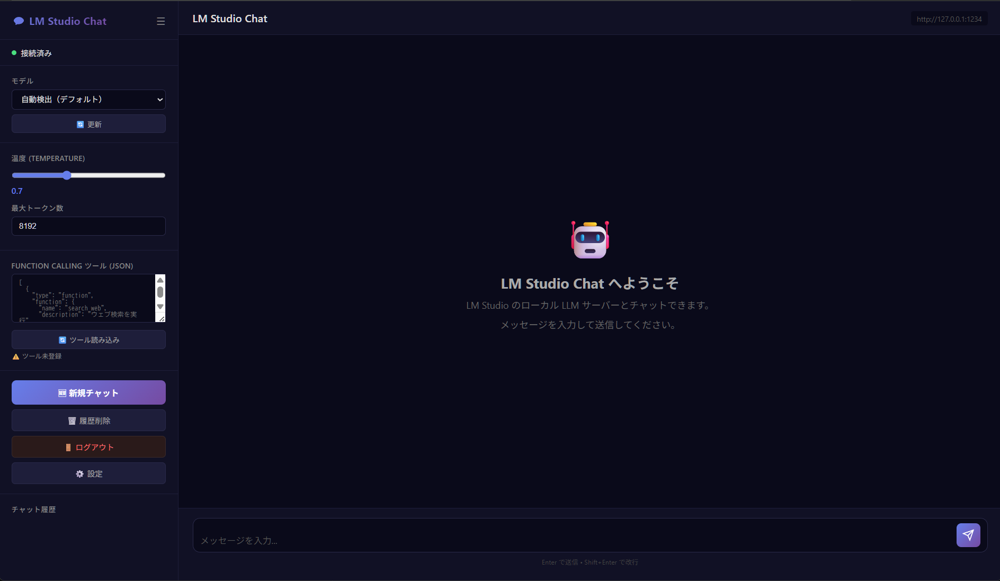
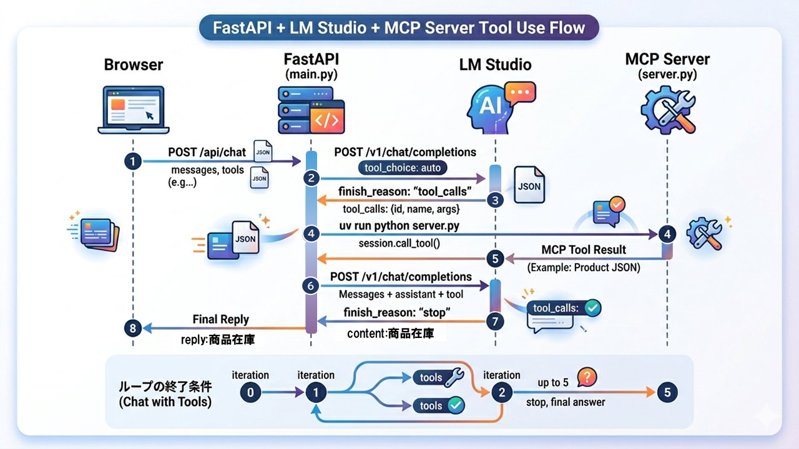
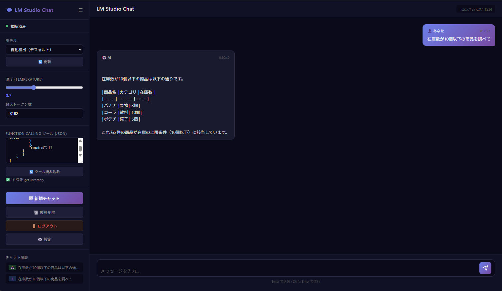

# LM Studio Chat tool with RAG

## 説明
LM Studioのサーバモードに対するチャットツール。FastAPIを使ったWebツールとして作成しています。

Function Calling（カスタムツール）を用いて、**MCPツールを連携**させてチャットの応答を得ることができます。



## 環境準備・起動方法

### モジュールのダウンロード

* githubからclone
    ```
    git clone https://github.com/TakkunRed/LMStudio-Chat.git
   ```

### 仮想環境を作成・アクティブ化

* 仮想環境を作成
    ```
    cd lmstudio-chat
    uv venv
    ```

* 仮想環境をアクティベート（Windowsの場合）
    ```
    .venv\Scripts\activate    # Windows
    ```

* 依存関係をインストール
    ```
    uv pip install -e .
    ```

### 設定ファイルの修正

* アプリの起動ポートの設定（必要に応じて）

    `.env`ファイルの`APP_PORT`を修正。デフォルト`8021`になっています。他のものと重複していなければそのままで。

    修正する場合は同時に、`main.py`の`async def api_update_settings`にある以下の`APP_PORT`を修正してください。
    ```
    # サーバー設定
    APP_HOST=0.0.0.0
    APP_PORT=8021
    ```

## 利用方法

### Chat ツールのサーバを起動

* Chat ツールのサーバ起動

    ```
    uv run python main.py
    ```

### 接続


* Webブラウザからアクセスしてください。アドレスはご自身の環境に合わせて接続ください。
    ```
    http://localhost:8021
    ```
* ログインする
    ユーザ、パスワードは、`.env` ファイルに記載されています。
    
    初期ユーザ `admin` 、初期パスワード `changeme` に設定されています。

* 画面が表示されたら、あとは画面に従って操作してください。


## MCP Serverを利用する場合の追加設定と利用方法

### MCP Serverを設定する

* MCP Serverを設定する

    `config.py`の以下の部分を使用したい MCP Server に合わせて修正してください。


    ```
    # ─── MCP サーバー設定 ────────────────────────────────────────────────────
    
        MCP_COMMAND = r"uv"
        MCP_ARGS = [
            "run",
            "--directory",
            r"E:\MY-MCPSV-POSTGRES\MCP-SERVER",
            "python",
            "server.py",
        ]
    ```

    上記の設定は、
    [MY-MCPSV-POSTGRES](https://github.com/TakkunRed/MY-MCPSV-POSTGRES) を使用した場合の設定となります。


### 利用方法

* 動作イメージ

    現行のLM Studioのサーバモードでは、MCP Serverが利用できないため、**Function Calling**という機能を利用しています。シーケンスが複雑になっているので、シーケンスイメージを記載します。

     

* Function Calling ツール (JSON) を設定し、ツールを読み込む

    Function Callingを利用するために、OpenAI 互換 API が要求する 「ツールスキーマ（Function Calling 形式）」のJSONファイルを使用する必要があります。以下は、MY-MCPSV-POSTGRESで定義しているMCP Server ツールのJSONイメージです。
    MCP Server ツールに合わせて、`Function Calling ツール (JSON)`に JSONテキストを貼り付けて、`ツール読み込み`を押下してください。「1件のツールを登録しました」と表示されればOKです。
    ```
    [
        {
            "type": "function",
            "function": {
            "name": "get_inventory",
            "description": "在庫管理システムの商品在庫を検索する。在庫数の上限、下限で商品を絞り込むことができます。",
            "parameters": {
                "type": "object",
                "properties": {
                "category": {
                    "type": "string",
                    "description": "商品カテゴリ。例: 果物, 飲料, 菓子"
                },
                "stock_le": {
                    "type": "integer",
                    "description": "在庫数の上限"
                },
                "stock_ge": {
                    "type": "integer",
                    "description": "在庫数の下限"
                }
                },
                "required": []
            }
            }
        }
    ]
    ```

* メッセージを入力し送信する

    `MY-MCPSV-POSTGRES` の場合は、以下のようにメッセージを入力するとMCP Server を使ったチャットが動作します。
    ```
    在庫管理システムで、果物の在庫数を調べて
    ```
    ```
    在庫数が10個以下の商品を調べて
    ```

    